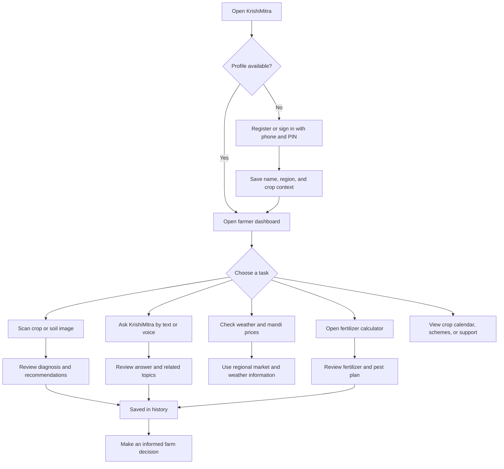
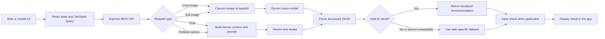

# AgroAIgnosis / KrishiMitra

KrishiMitra is a mobile-first agricultural assistant for Indian farmers. It combines crop and soil image analysis, multilingual agricultural chat, regional information, and practical farm-planning tools in one application.

## What The App Does

### Farmer onboarding and profile

- Phone number and 4-digit PIN account access.
- New-user registration from the same access screen.
- Farmer name, state/region, and primary crop context.
- Session-based authentication.
- Profile page with saved farmer details.
- Regional language selection and localized user-facing responses.
- Theme support and responsive mobile-first navigation.

### AI crop and soil analysis

- Upload crop or soil images up to 10 MB.
- Crop health and disease analysis using Gemini vision.
- Crop type, diagnosis, confidence, status, treatment steps, and preventive measures.
- Soil type, soil condition, pH estimate, fertility assessment, and improvement suggestions.
- Recommendations tailored to Indian farming practices.
- Structured JSON responses make results easy to display in the UI.
- Graceful fallback analysis when the AI service is unavailable or an image cannot be analyzed.
- Every completed analysis can be stored in the farmer's history.

### KrishiMitra agricultural chat

- Context-aware farming questions and answers.
- Gemini-powered responses for crop diseases, pest control, irrigation, soil care, fertilization, and general farm decisions.
- Uses the farmer's name, region, and primary crop when available.
- Related follow-up topics and actionable response flag.
- Voice-friendly interaction through browser speech recognition.
- Chat messages are stored for later review.

### Farm intelligence and planning

- Weather information for the farmer's selected region.
- Mandi price dashboard with crop prices, market, unit, trend, and percentage change.
- AI-generated fertilizer and pest-management advice based on crop, farm size, soil type, growth stage, water source, and region.
- Crop calendar for seasonal planning.
- Government schemes and farmer-support information.
- Farmer support page for help and guidance.

### Accessibility and reliability

- Multilingual interface support for English, Hindi, Marathi, Punjabi, Gujarati, Tamil, Telugu, Kannada, Bengali, Malayalam, and Odia.
- Region-to-language defaults for Indian states.
- Voice navigation and voice recording components.
- Offline status banner when the browser loses connectivity.
- Production service-worker support for offline caching.
- Loading, error, empty, and fallback states throughout the main workflows.

## How The App Works

### Farmer journey



### AI request pipeline



## Main Screens

- `/` - Farmer dashboard with greeting, quick actions, weather, recent activity, and key metrics.
- `/analysis` - Crop and soil image upload and result review.
- `/chat` - Text and voice agricultural assistant.
- `/history` - Previous image analyses and chat activity.
- `/mandi` - Regional mandi prices and market trends.
- `/calculator` - Fertilizer and pest-management recommendations.
- `/calendar` - Crop planning calendar.
- `/schemes` - Government schemes and agricultural support programs.
- `/support` - Farmer help and support.
- `/profile` - Profile, language, and preference context.
- `/why-krishimitra` - Public product explanation/demo page.

## Technology Stack

### Frontend

- React 18 with TypeScript.
- Vite development and production build tooling.
- Wouter for client-side routing.
- Tailwind CSS and shadcn/ui components built on Radix UI.
- TanStack Query for API state, caching, and request handling.
- Framer Motion for interface motion.
- Recharts for data visualization.
- Web Speech API for browser voice interaction.

### Backend

- Node.js, Express, and TypeScript.
- `tsx` for development execution.
- Multer memory storage for image uploads.
- Express sessions for authentication state.
- Drizzle ORM with PostgreSQL/Neon support.
- In-memory storage fallback for local development.
- Gemini API through `@google/genai`.
- Hugging Face image classification as an additional image-analysis fallback when configured.

## API Surface

| Method | Endpoint | Purpose |
|---|---|---|
| POST | `/api/auth/access` | Sign in or create an account |
| POST | `/api/auth/register` | Register a farmer account |
| POST | `/api/auth/login` | Sign in with phone and PIN |
| POST | `/api/auth/logout` | End the current session |
| GET | `/api/auth/me` | Read the current authenticated profile |
| POST | `/api/analyze-image` | Analyze a crop or soil image |
| GET | `/api/analysis-results/:userId` | List saved analyses |
| GET | `/api/analysis-result/:id` | Read one analysis |
| POST | `/api/chat` | Generate and save an agricultural chat response |
| GET | `/api/chat-history/:userId` | List saved chat messages |
| GET | `/api/weather` | Get weather for a region |
| GET | `/api/mandi-prices` | Get regional mandi prices |
| POST | `/api/fertilizer-advice` | Generate crop-specific fertilizer advice |
| GET | `/api/health` | Check API health |

## Local Setup

### Requirements

- Node.js 18 or newer.
- npm.
- Gemini API key for live AI features.
- PostgreSQL/Neon database variables if using persistent database storage.

### Install and run

```bash
npm install
npm run dev
```

The combined development server serves both the frontend and backend at:

```text
http://localhost:5000
```

### Environment variables

Create a `.env` file in the project root:

```env
GEMINI_API_KEY=your_gemini_api_key
HUGGINGFACE_API_KEY=your_huggingface_api_key
SESSION_SECRET=replace_with_a_long_random_secret
DATABASE_URL=your_postgres_connection_string
```

`GEMINI_API_KEY` is required for live Gemini chat and vision analysis. Hugging Face and database variables are optional depending on the selected deployment/storage configuration.

## Production Build

```bash
npm run check
npm run build
npm start
```

The build creates the Vite client bundle and bundles the Express server for production.

## Safety and Product Boundaries

- AI outputs are advisory and should be verified with local agricultural officers or qualified agronomists for serious crop disease, pesticide, or fertilizer decisions.
- Image quality affects diagnosis confidence; farmers should upload clear, well-lit images that show symptoms closely.
- Pesticide and fertilizer recommendations should follow local regulations, product labels, crop-specific restrictions, and safe handling practices.
- API rate limiting is enabled for authentication and AI-heavy endpoints.

## Project Structure

```text
client/
  src/
    components/       Reusable UI, upload, voice, and result components
    pages/            Dashboard and feature screens
    hooks/            Profile, language, theme, and responsive state
    i18n/             Translation and regional language mapping
server/
  index.ts            Express and Vite server entry point
  routes.ts           REST API routes
  storage.ts          Storage abstraction and local persistence
  services/
    openai.ts         Gemini, Hugging Face, and agricultural AI services
    weather.ts        Weather integration and fallback data
shared/
  schema.ts           Shared data models and validation schemas
```

## Validation

Run the TypeScript check before submitting changes:

```bash
npm run check
```
